```mermaid
graph TB
    subgraph Frontend["🖥️ Frontend (React + TypeScript)"]
        UI[Dashboard & Note Editor]
        Record[Audio Recording]
    end
    
    subgraph Backend["⚙️ Backend (Flask)"]
        Auth[Authentication]
        Audio[Audio Processing]
        API[REST API]
    end
    
    subgraph AI["🤖 AI Services"]
        Whisper[OpenAI Whisper<br/>Speech-to-Text]
        GoogleSTT[Google Speech-to-Text<br/>Cloud Transcription]
        Gemini[Google Gemini 2.0<br/>Note Generation]
    end
    
    subgraph Data["💾 Data Layer"]
        MongoDB[(MongoDB Atlas<br/>User & Notes)]
    end
    
    subgraph Google["☁️ Google Cloud"]
        OAuth[OAuth 2.0<br/>Authentication]
        Docs[Google Docs API<br/>Export]
        Drive[Google Drive<br/>Storage]
    end
    
    UI --> API
    Record --> API
    API --> Auth
    API --> Audio
    Audio --> Whisper
    Audio --> GoogleSTT
    API --> Gemini
    Auth --> OAuth
    API --> MongoDB
    API --> Docs
    Docs --> Drive
    
    style Frontend fill:#61DAFB20,stroke:#61DAFB
    style Backend fill:#00000020,stroke:#000000
    style AI fill:#FF6B6B20,stroke:#FF6B6B
    style Data fill:#47A24820,stroke:#47A248
    style Google fill:#4285F420,stroke:#4285F4
```

# 🎓 NoteFlow — AI-Powered Lecture Transcription & Study Assistant

[](https://google-lecture-transcriber.vercel.app/)
[](LICENSE)

> **Democratizing education through intelligent, real-time lecture transcription and AI-powered note generation.**

NoteFlow is an accessible, AI-driven platform that transforms live lectures into structured, searchable study materials—making education truly inclusive for **Deaf and Hard-of-Hearing (HoH) students** and enhancing learning outcomes for everyone.

**🌐 [Try NoteFlow Live](https://google-lecture-transcriber.vercel.app/)**

---

## 🌟 The Problem We're Solving

Traditional lectures create **significant accessibility barriers**:
- 📢 Audio-dependent content excludes Deaf/HoH students
- 👥 Limited interpreter availability in smaller institutions
- 📖 Manual note-taking is incomplete and error-prone
- 🔍 No searchable record of past lectures

**NoteFlow ensures that understanding—not just hearing—is accessible to everyone.**

---

## ✨ Key Features

### 🎙️ **Live Audio Capture**
Record lectures directly from your browser with a single click—no installation required.

### 🧠 **Dual-AI Transcription**
- **Google Speech-to-Text API** — Cloud-based, enterprise-grade transcription[web:79]
- **OpenAI Whisper** — Local fallback for offline reliability
- Automatic punctuation and speaker detection

### 📝 **AI-Powered Note Generation**
**Google Gemini 2.0** transforms raw transcripts into structured study guides:
- Main topic extraction
- Key points with bullet formatting
- Important concepts with definitions
- Concise summaries

### 📂 **Smart Organization**
- Create custom folders for subjects/courses
- Mark notes as favorites for quick access
- Full-text search across all lectures
- Automatic timestamp tracking

### ☁️ **Google Workspace Integration**
- **One-click export to Google Docs** for collaboration
- **OAuth 2.0 authentication** for secure, frictionless login
- Automatic syncing to user's Google Drive

### 📄 **Professional PDF Export**
Generate beautifully formatted PDFs with custom styling for offline study or printing.

---

## 🏗️ Architecture

## 🏗️ Architecture


---

## 🛠️ Tech Stack

### **Frontend**


- **React 18** with TypeScript for type safety
- **Tailwind CSS** for responsive, modern UI
- **Radix UI** for accessible component primitives
- **Vite** for blazing-fast development

### **Backend**


- **Flask** for RESTful API architecture
- **MongoDB** for flexible document storage
- **PyMongo** for database operations
- **faster-whisper** for optimized local transcription

### **AI & Cloud Services**


1. **Google Speech-to-Text API** — Primary transcription engine[web:79]
2. **Google Gemini 2.0** — AI summarization & structuring[web:104]
3. **Google OAuth 2.0** — Secure authentication
4. **Google Docs API** — Note export & persistence
5. **OpenAI Whisper** — Fallback transcription (offline-capable)

---

## 🚀 Quick Start

### Prerequisites
- Python 3.10+
- Node.js 18+
- MongoDB account (free tier: [MongoDB Atlas](https://www.mongodb.com/cloud/atlas))
- Google Cloud project with enabled APIs

### 1️⃣ Clone & Install

```bash
# Clone repository
git clone https://github.com/yourusername/noteflow.git
cd noteflow

# Backend setup
cd backend
pip install -r requirements.txt

# Frontend setup
cd ../frontend
npm install
```
NoteFlow uses a modern **microservices architecture** with clear separation of concerns:

### 2️⃣ Environment Configuration

#### Backend Configuration

Create `backend/.env`:

```env
# MongoDB Configuration
MONGODB_URL=mongodb+srv://<db_username>:<db_password>@cluster0.xxxxx.mongodb.net/
MONGODB_USER_ID=your_mongodb_username
MONGODB_PASSWORD=your_mongodb_password

# Google AI APIs
GEMINI_API_KEY=your_gemini_api_key_here
GEMINI_MODEL=gemini-2.0-flash

# Google Cloud Speech-to-Text
GOOGLE_APPLICATION_CREDENTIALS=google-speech-credentials.json

# Whisper Configuration
WHISPER_MODEL=small

# Flask Configuration
SECRET_KEY=your-secret-key-generate-random-string
FLASK_ENV=development
```
